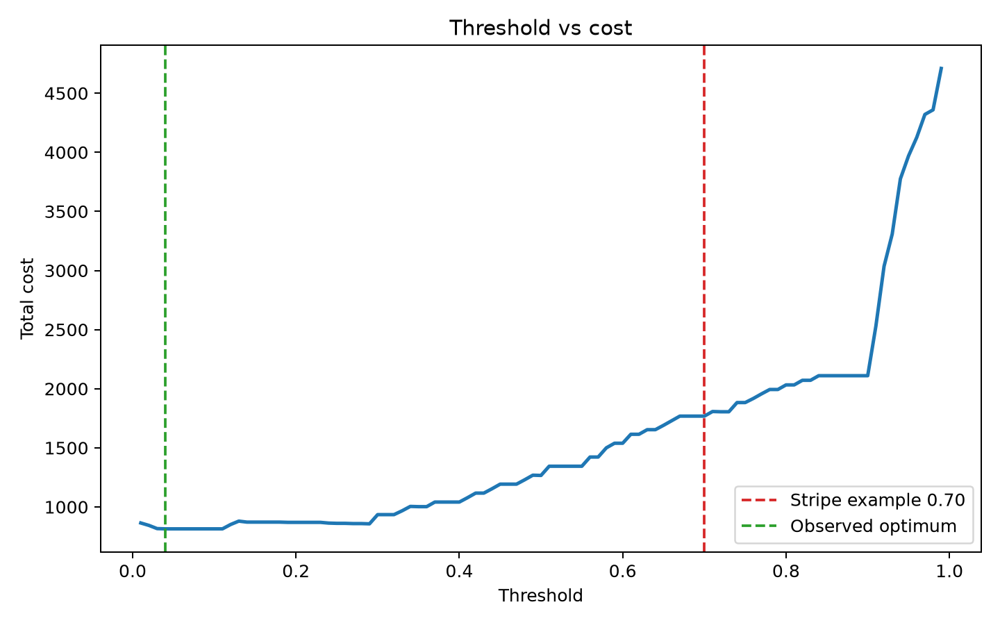
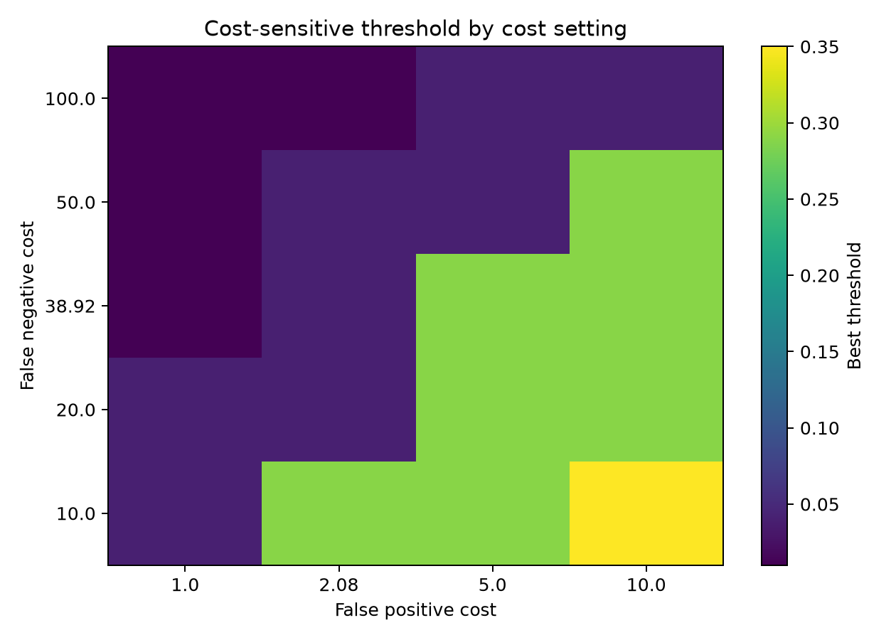
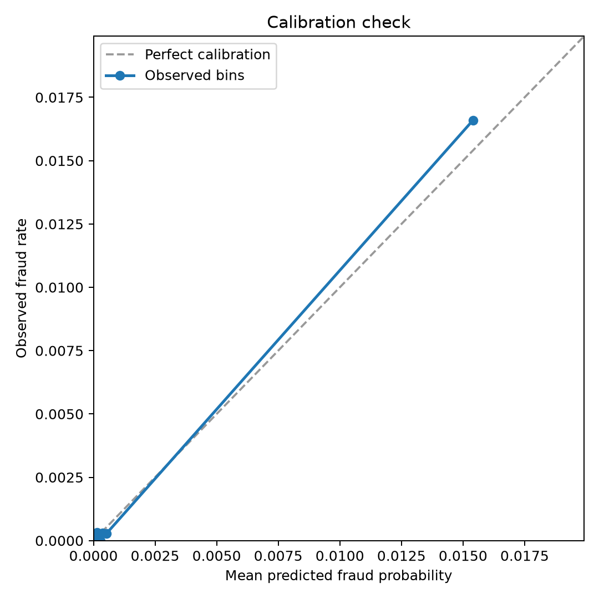

# Cost-Sensitive Fraud Threshold Reconstruction

[](https://doi.org/10.5281/zenodo.22043545)

An independent reconstruction of the cost-sensitive decision example in Stripe's public guide, ["A primer on machine learning for fraud detection"](https://stripe.com/ae/guides/primer-on-machine-learning-for-fraud-protection).

This is not Stripe Radar. Stripe does not publish Radar's model, features, training data, or production threshold. This repo reconstructs the part Stripe does disclose: the economics that turn a fraud probability into a block/allow decision.

## Result

Stripe's arithmetic transfers exactly. The illustrative threshold is not cost-optimal in this reconstruction.

| Claim | Stripe | This repo | Status |
| --- | ---: | ---: | --- |
| Legitimate profit on `$26` sale at `8%` margin | `$2.08` | `$2.08` | matched |
| Fraud loss with `$15` chargeback fee | `$38.92` | `$38.92` | matched |
| Fraud-to-profit ratio | `18.71x` | `18.71x` | matched |
| Break-even precision | `5.07%` | `5.07%` | matched |
| Example block rule | illustrative `P(fraud) > 0.70` | evaluated against public data | tested |
| Cost-optimal threshold | not published | `0.04` fixed cost, `0.33` amount-scaled | reconstruction result |

Across five train/test seeds, the cost-optimal threshold mean is `0.108` with standard deviation `0.079`. The single-seed threshold sweep gives `0.04`.

The key result is narrow: Stripe does not claim `0.70` is a universal production optimum, but that illustrative operating point was not cost-optimal under this independent reconstruction. On this public dataset, the fixed-cost `0.70` policy cost `$1,768.04`; the observed fixed-cost optimum cost `$814.36`.

| Policy | Blocked | False positives | False negatives | Cost | Cost vs optimum |
| --- | ---: | ---: | ---: | ---: | ---: |
| Always allow | `0` | `0` | `123` | `$4,787.16` | `+$3,972.80` |
| Always block | `71,202` | `71,079` | `0` | `$147,844.32` | `+$147,029.96` |
| Stripe example `0.70` | `86` | `8` | `45` | `$1,768.04` | `+$953.68` |
| Cost optimum `0.04` | `140` | `36` | `19` | `$814.36` | `$0.00` |

The gap is the artifact: once the economics are attached to a real score distribution, the operating point depends on model calibration, class prevalence, feature quality, and merchant cost assumptions. The calibration check has a Brier score of `0.000504`; the highest score bin averages `0.0154` predicted fraud probability against `0.0166` observed fraud rate, so the low threshold is not just an obvious calibration failure.

The amount-scaled sanity check moves the optimum from `0.04` to `0.33`, while still below `0.70`. That makes the result more honest: the exact threshold is cost-model dependent, but the reconstructed operating point remains lower than Stripe's example policy.

| Cost model | Optimal threshold | Cost at optimum | Cost at `0.70` |
| --- | ---: | ---: | ---: |
| Fixed Stripe example | `0.04` | `$814.36` | `$1,768.04` |
| Amount-scaled reconstruction | `0.33` | `$3,167.77` | `$5,626.45` |

## Figures







## Data

The run uses the Zenodo mirror of the European credit-card fraud dataset:

- Zenodo record: https://zenodo.org/records/7395559
- DOI: `10.5281/zenodo.7395559`
- File: `creditcard.csv`
- MD5: `e90efcb83d69faf99fcab8b0255024de`

The raw 150 MB CSV is not committed. See [data/README.md](data/README.md).

## Reproduce

```bash
python -m venv .venv
source .venv/bin/activate
pip install -e ".[dev]"
python scripts/download_data.py
python experiments/threshold_sweep.py
python experiments/error_analysis.py
python experiments/sensitivity_analysis.py
python experiments/multi_seed.py
python experiments/plots.py
pytest
ruff check .
```

Or run the whole pipeline:

```bash
python scripts/run_all.py
```

If `data/raw/creditcard.csv` is missing, the experiment scripts fall back to a deterministic synthetic imbalanced dataset. The checked-in result uses the real Zenodo CSV.

## Files

| Path | Purpose |
| --- | --- |
| `CLAIMS.md` | Source claims being tested |
| `reports/comparison.md` | Main comparison report |
| `reports/final_report.md` | Final research-style report |
| `docs/cost-model.md` | Stripe-derived costs vs reconstruction assumptions |
| `src/cost_sensitive_scoring/` | Cost model, threshold evaluation, model training |
| `experiments/` | Reproducible experiment scripts |
| `results/` | Saved result CSVs and summary |
| `figures/` | Generated plots |
| `data/README.md` | Dataset source and checksum |

## Current Limitations

- Stripe's private data and production features are unavailable.
- The public dataset is offline and historical, not a live payment stream.
- The model family and calibration method are fixed.
- The `0.70` value is Stripe's illustrative threshold, not a disclosed universal production optimum.
- The main `0.04` threshold is a fixed-cost reconstruction result; amount-scaled costs move the optimum to `0.33`.

## Release

- GitHub release: [`v0.1.1`](https://github.com/Jaswanth5387/cost-sensitive-scoring-replication/releases/tag/v0.1.1)
- Zenodo DOI: [`10.5281/zenodo.22043545`](https://doi.org/10.5281/zenodo.22043545)
- Remaining outreach: post the short comparison note drafted in [reports/comparison.md](reports/comparison.md), if Stripe's platform allows it.

## License

MIT. Dataset rights are separate; see the Zenodo record and [data/README.md](data/README.md).
