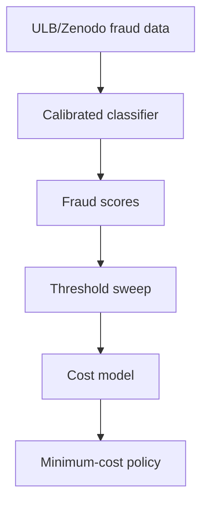

# Final Report

## Abstract

This repository independently reconstructs the cost-sensitive fraud-decision example in Stripe's public guide, "A primer on machine learning for fraud detection." The implementation reproduces Stripe's published economic arithmetic exactly: a `$26` sale at `8%` margin gives `$2.08` legitimate profit; adding a `$15` chargeback fee gives a `$38.92` fraud loss; the fraud-to-profit ratio is `18.71x`; and the break-even precision is `5.07%`.

The reconstruction then applies those economics to a calibrated classifier trained on the public ULB/Zenodo credit-card fraud dataset. Stripe's illustrative `P(fraud) > 0.70` policy is evaluated as a comparison point, not treated as a disclosed production optimum. Under the fixed Stripe-example costs, the cost-minimizing threshold is `0.04`, with total modeled cost `$814.36` versus `$1,768.04` at `0.70`. Under an amount-scaled cost interpretation, the optimum moves to `0.33`, while still remaining below `0.70`.

The result is not a claim about Stripe Radar's production threshold. It is a reconstruction result: the published arithmetic transfers exactly, while the operating point depends on score distribution, calibration, data, and cost interpretation.

## Original Claim

Stripe's guide distinguishes between two problems:

| Problem | Stripe's framing | What this repo tests |
| --- | --- | --- |
| Model quality | Build a classifier that assigns fraud probabilities. | Train a calibrated public-data classifier. |
| Business policy | Pick an operating point on the precision-recall curve. | Sweep thresholds under explicit costs. |

The guide uses `P(fraud) > 0.70` as an illustrative policy threshold for explaining precision, recall, and false positive rate. It does not publish a universal cost-optimal threshold or Stripe Radar's production threshold.

## Claim to Reconstruction Table

| Stripe statement | Stripe value | Reconstruction | Result |
| --- | ---: | ---: | --- |
| Average sale | `$26.00` | `$26.00` | exact match |
| Margin | `8%` | `8%` | exact match |
| Legitimate profit | `$2.08` | `$2.08` | exact match |
| Product cost | `$23.92` | `$23.92` | exact match |
| Chargeback fee | `$15.00` | `$15.00` | exact match |
| Fraud loss | `$38.92` | `$38.92` | exact match |
| Cost ratio | `18.71x` | `18.71x` | exact match |
| Break-even precision | `5.07%` | `5.07%` | exact match |
| Example threshold | `0.70` | evaluated | comparison target |
| Cost-optimal threshold | not published | `0.04` fixed cost, `0.33` amount-scaled | reconstruction result |

## Reconstruction Pipeline



## Main Results

| Result | Stripe guide | Reconstruction |
| --- | ---: | ---: |
| Legitimate profit | `$2.08` | `$2.08` |
| Fraud loss | `$38.92` | `$38.92` |
| Cost ratio | `18.71x` | `18.71x` |
| Break-even precision | `5.07%` | `5.07%` |
| Example threshold | `0.70` | tested |
| Cost-optimal threshold | not disclosed | `0.04` |
| Cost at `0.70` | not disclosed | `$1,768.04` |
| Cost at optimum | not disclosed | `$814.36` |

The fixed-cost optimum reduces modeled cost by `53.94%` relative to the illustrative `0.70` threshold:

```text
(1768.04 - 814.36) / 1768.04 = 0.5394
```

## Error Analysis

| Policy | Blocked | False positives | False negatives | Precision | Recall | Cost |
| --- | ---: | ---: | ---: | ---: | ---: | ---: |
| Always allow | `0` | `0` | `123` | `0.0000` | `0.0000` | `$4,787.16` |
| Always block | `71,202` | `71,079` | `0` | `0.0017` | `1.0000` | `$147,844.32` |
| Stripe example `0.70` | `86` | `8` | `45` | `0.9070` | `0.6341` | `$1,768.04` |
| Cost optimum `0.04` | `140` | `36` | `19` | `0.7429` | `0.8455` | `$814.36` |

At `0.04`, precision is `74.29%`, far above the `5.07%` break-even precision. Lowering the threshold from `0.70` to `0.04` adds `28` false positives but prevents `26` additional false negatives. Under the fixed Stripe-example costs, that trade is economically favorable.

## Confusion Matrices

| Threshold | Action | Actual legitimate | Actual fraud |
| ---: | --- | ---: | ---: |
| `0.04` | allow | `71,043` | `19` |
| `0.04` | block | `36` | `104` |
| `0.70` | allow | `71,071` | `45` |
| `0.70` | block | `8` | `78` |

## Score Distribution at the Two Policies

| Threshold | Legitimate at or above | Fraud at or above | Legitimate below | Fraud below |
| ---: | ---: | ---: | ---: | ---: |
| `0.04` | `36` | `104` | `71,043` | `19` |
| `0.70` | `8` | `78` | `71,071` | `45` |

## Calibration

| Metric | Value |
| --- | ---: |
| Brier score | `0.000504` |
| Highest-bin mean score | `0.0154` |
| Highest-bin observed fraud rate | `0.0166` |

The calibration check does not show a grossly broken probability scale in the highest populated score bin. The low threshold is mainly a decision-policy result under asymmetric costs, not merely a calibration artifact.

## Cost-Interpretation Sanity Check

| Cost model | Optimal threshold | Cost at optimum | Cost at `0.70` | Relative reduction vs `0.70` |
| --- | ---: | ---: | ---: | ---: |
| Fixed Stripe example | `0.04` | `$814.36` | `$1,768.04` | `53.94%` |
| Amount-scaled reconstruction | `0.33` | `$3,167.77` | `$5,626.45` | `43.70%` |

The threshold changes materially under amount-scaled costs. That is a real limitation of the headline `0.04` number. However, the broader result survives: in both cost interpretations, the reconstructed optimum is below the illustrative `0.70` policy.

## Multi-Seed Robustness

| Seed | ROC AUC | Average precision | Optimal threshold | Cost |
| ---: | ---: | ---: | ---: | ---: |
| `1` | `0.9828` | `0.8805` | `0.06` | `$550.24` |
| `7` | `0.9874` | `0.8378` | `0.04` | `$814.36` |
| `13` | `0.9675` | `0.7725` | `0.09` | `$1,070.76` |
| `23` | `0.9656` | `0.7917` | `0.24` | `$871.40` |
| `42` | `0.9720` | `0.8320` | `0.11` | `$808.12` |

Across seeds, the optimal threshold mean is `0.108` with standard deviation `0.079`. The main-run `0.04` threshold is the lowest observed seed, so it should not be over-read as a universal value. The stable result is directional: the reconstructed fixed-cost optimum remains below `0.70`.

## What This Reconstruction Does Not Claim

| Item | Reproduced? |
| --- | --- |
| Stripe proprietary transaction data | no |
| Stripe network features | no |
| Stripe model architecture or weights | no |
| Stripe production calibration | no |
| Stripe actual production threshold | no |
| Stripe published economic arithmetic | yes |
| Stripe illustrative threshold evaluated independently | yes |
| Public-data cost-sensitive reconstruction | yes |

This experiment cannot infer Stripe Radar's actual production-optimal threshold. Stripe's production system uses proprietary data, network-level signals, operational constraints, counterfactual production evaluation, and merchant-specific tradeoffs that are unavailable here.

## Divergence Analysis

The divergence has several plausible causes:

1. The public dataset is not Stripe's data.
2. The public feature set does not include Stripe network signals.
3. The classifier and calibration method are independent choices.
4. The dataset's fraud prevalence and score distribution differ from a production payment stream.
5. The main cost model treats all transactions as the `$26` Stripe example.
6. The amount-scaled sanity check moves the optimum from `0.04` to `0.33`, showing that cost interpretation matters.
7. Stripe's guide describes operating-point choice as a business problem, not a number determined by model AUC alone.

## Reproducibility

Run the full artifact with:

```bash
python scripts/run_all.py
```

The command downloads/verifies the public dataset, regenerates result CSVs, regenerates figures, runs tests, and runs lint.

Important generated outputs:

| Path | Purpose |
| --- | --- |
| `results/threshold_sweep.csv` | Fixed-cost threshold sweep |
| `results/policy_comparison.csv` | Baseline and policy comparison |
| `results/cost_model_comparison.csv` | Fixed vs amount-scaled cost sanity check |
| `results/confusion_matrices.csv` | Confusion matrices at `0.04` and `0.70` |
| `results/score_distribution.csv` | Score distribution around the two thresholds |
| `results/multi_seed.csv` | Seed-by-seed robustness |
| `figures/threshold_cost.png` | Threshold cost curve |
| `figures/sensitivity_heatmap.png` | Cost sensitivity plot |
| `figures/calibration.png` | Calibration plot |

## Final Note

The clean result is not "Stripe is wrong." The clean result is narrower and stronger: Stripe's published arithmetic reproduces exactly, while its illustrative `0.70` operating point is not cost-minimizing in this independent public-data reconstruction.
